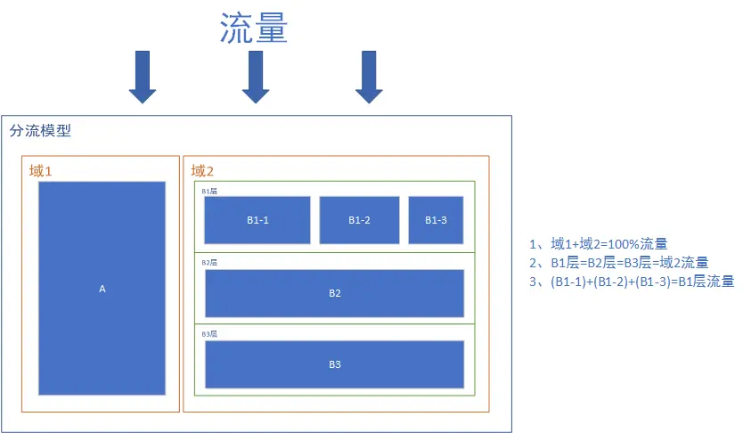

# 常见分析方法

## 异动归因

### 指标横向分层

### 指标纵向下钻

### 贡献率计算

#### 加法模型

#### 除法模型

#### 比率模型

## 辛普森悖论

- 是什么：分组时趋势存在，但是合并后趋势消失或反转。可能产生误导性结果。
- 产生因素
  - 混杂变量：存在其他变量在各个组里分布不均匀，导致整体趋势与分组趋势不一致。
  - 数据分组方式：分组方式可能掩盖了真实的趋势
  - 样本量差异：不同组的样本量差异较大时，某一组的趋势可能在整体数据中被放大或掩盖。

- 怎么避免
  - 合理分组：分组应*基于理论*或*实际背景*，而不是随意划分。
  - 控制混杂变量：识别并控制混杂变量，可以通过*分层分析*、*回归分析*或*多变量分析*来实现。
  - 使用适当的统计方法：如多变量回归分析，以控制多个变量的影响，避免辛普森悖论的发生。

## 费米问题

- 是什么：对复杂或缺乏直接数据的问题进行粗略估算。
- 原理：所做的假设越多，被抵消的概率就会越大。
- 答题思路：**逻辑拆解**分解问题为多个小步骤，逐步估算每个部分的量，最终得到整体答案。
- 案例：
  1. 芝加哥有多少个钢琴调音师
     1. 问题拆解  
        总人数=全年调音师工作总时长/每位调音师每年工作时长
        =（芝加哥钢琴数*调音频率*每次时长）/（一年工作天数*每天工作时长）  
     2. 问题估算：不要估算其本身，**先估算其上下界**，再取合适的值。
        钢琴数估算：居民数$\to$家庭数$\to$每个家庭可能拥有钢琴的概率  
        调音频率估算：不常见岗位$\to$最高1年3次；最低10年1次$\to$估算3年1次  
        每次时长：不低于1h，不高于10h。估算为3h。

## A/B test

### 统计原理

[假设检验](./统计学知识.md#假设检验)

### 是什么？

对用户分析，每组使用一个方案（单变量），在相同的时间维度上观察用户反映。

### 流程

1. 分析问题，做出假设。
2. 设定指标，用于衡量版本的好坏。
3. 对用户分流
   - 同时性
   - 同质性：每组用户特征相似。
   - 唯一性
   - 均匀性
4. 确定实验周期
5. 实验设计与开发
   - 创建变量
   - 埋点设计
6. 实验观测
   - 样本量是否符合预期
   - 埋点是否合理
7. 实验结果分析
8. 决策

### 对用户处理

> 流量是有限的，如果一个实验需要10%的流量测试，那么同时只能保证10个测试实验。但是abtest的需求是大量且耗时的。所以就需要好好设计实验的用户。同时避免用户受到其他实验的影响。

- 用户分层与分流  
  - 每个实验是一层，层与层之间的实验是**正交的**。当流量穿过一层是，流量再次被打散（随机分成不同的组）。  
  - 同一层的流量是**互斥的**。不同的实验不能用相同的流量（不能同一层的用户出现在两个实验中）。
  - 流量是由上到下过分流模型。
      
      域1和域2互斥。
      B1、B2、B3层流量相等且正交。
  - **理解**：对于可能相互影响的实验，放置在同一层，流量不重叠。没有影响的实验放在不同层，但是数据穿过的时候重新打散，组里的数据不同。

- 确定样本量
   1. 绝对值类指标
   2. 比率类指标
   3. [计算工具](https://www.evanmiller.org/ab-testing/)

### 常见问题

1. 什么时候不能用abtest？
2. 选取的指标不显著，怎么判断实验的收益
   - 不显著是什么意思？  
   即实验组和对照组之间的差距是由抽样误差导致的。得到的结果没有充足的理由拒绝原假设（实验效果不显著）
   - 可以进一步观测每一天的指标变化情况，如果每天的变化由于对照组，虽然可能统计上不显著，但是实际效果优。
3. 实验结果显著，但是全量不显著会是什么原因？
   - 用户抽样不科学
   - 实验层选择错误
   - 实验人群和上线人群不一致
   - 用户的新奇效应和Primacy效应
     - 用户因为新奇感而表现的不可持续行为。当好奇心消退之后，恢复到一般的水平。
   - 统计实验显著和实际显著之间的差异
     - 统计学上的显著并不意味着实际效果显著，统计上的显著指的是两组之间的差异不是由随机性带来的，而实际的显著是一个业务对改进商业价值的业务判断。

### AA实验

尽管实验组和对照组产生了显著性的差异，但是依然无法确认这种差异确实为实验条件不同造成的。设置AA实验。

- 是什么？

- 作用？
  - 验证用户所在层分流均匀和正交性、保证分流同质
  - 是否存在指标异常
  - 防止上一个AB实验释放的流量带来的惯性的影响
  
- 怎么做？
  - 设置空跑期。正式实验开始前，先空跑一段时间，查看两组的差异。
    - 显著：数据弃用，重新选组
    - 不显著：记录两组之间的均值差，在实验期结束时，用实验期的组间差异-空跑期的组件差异=净增长。
  - 设置三组流量：对照组、实验组、AA对照组。
- 更好的方式：AA波动比率

### AB 实验的缺点

- 成本问题
- 用户角度
- 开发角度

### 参考资料

1. [AB test](https://jace-yang.github.io/Full-Stack_Data-Analyst/Causal_Inference/1_AB_testing.html#aa)